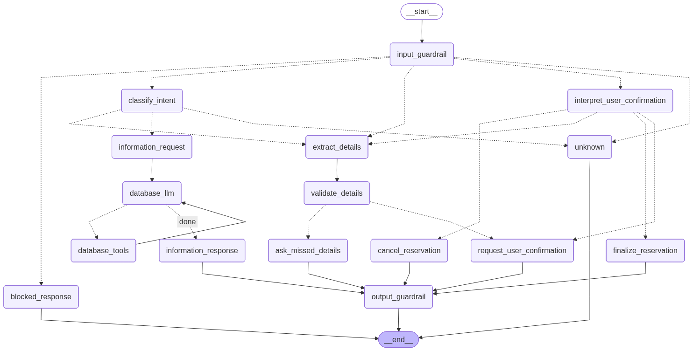

# Parking Space Reservation Chatbot

A conversational AI assistant for parking space reservations, built with LangGraph. It handles natural-language Q&A about parking facilities and guides users through the full reservation flow, backed by a vector store (Weaviate) for static knowledge and a relational database (PostgreSQL) for live availability and booking data.

## Architecture

The agent is implemented as a LangGraph state machine with the following stages:

```
User input
  └─► Input guardrail (Presidio PII scan)
        ├─► [blocked] → rejection message
        └─► [ok] → Intent classifier
                    ├─► information_request → RAG (Weaviate) + DB tools → Output guardrail
                    └─► reservation        → Detail extraction → Validation → Confirmation → Booking
```



## Tech stack

| Component | Technology |
|-----------|-----------|
| Agent framework | LangGraph |
| LLM | OpenAI-compatible endpoint (configurable) |
| Vector store | Weaviate 1.38 |
| Vectorizer | `sentence-transformers/multi-qa-MiniLM-L6-cos-v1` |
| Reranker | `cross-encoder/ms-marco-MiniLM-L-6-v2` |
| Relational DB | PostgreSQL 17 |
| PII guardrail | Microsoft Presidio + spaCy `en_core_web_lg` |

## Project structure

```
.
├── app.py                              # Chatbot CLI entry point
├── assets/
│   ├── static/                         # Markdown knowledge base (ingested into Weaviate)
│   └── dynamic/                        # SQL seed files (loaded into PostgreSQL on first start)
├── chatbot/
│   ├── assistant.py                    # ParkingAssistant wrapper
│   ├── database/                       # Weaviate retriever + PostgreSQL store
│   ├── graph/                          # LangGraph nodes, edges, prompts, state
│   ├── guardrail/                      # Presidio-based PII filtering
│   ├── scripts/
│   │   ├── ingest_static_data.py       # Load markdown assets into Weaviate
│   │   └── run_evaluation.py           # RAG + LLM quality evaluation
│   ├── settings.py                     # Pydantic settings (reads .env)
│   └── utils/                          # Shared utilities and evaluation helpers
├── docker-compose.yaml
└── pyproject.toml
```

## Prerequisites

- [Docker](https://docs.docker.com/get-docker/) and Docker Compose
- [uv](https://docs.astral.sh/uv/getting-started/installation/) (Python package and venv manager)
- Python 3.13+

## Setup

### 1. Start infrastructure services

```bash
docker compose up -d
```

This starts four services:

| Service | Description | Port |
|---------|-------------|------|
| `weaviate` | Vector database | 8080 (HTTP), 50051 (gRPC) |
| `t2v-transformers` | Text-to-vector inference (`multi-qa-MiniLM-L6-cos-v1`) | internal |
| `reranker-transformers` | Reranker inference (`ms-marco-MiniLM-L-6-v2`) | internal |
| `postgres` | Relational database (seeded from `assets/dynamic/`) | 5432 |

### 2. Create virtual environment and install dependencies

```bash
uv venv
uv sync
```

### 3. Download the spaCy model

The PII guardrail (Presidio) requires the `en_core_web_lg` spaCy model:

```bash
uv run python -m spacy download en_core_web_lg
```

### 4. Configure environment variables

Copy the example below to a `.env` file in the project root and fill in your values:

```dotenv
# LLM (OpenAI-compatible endpoint — OpenAI, LM Studio, etc.)
OPENAI_LLM_URL=https://api.openai.com/v1
OPENAI_LLM_API_KEY=your-api-key
OPENAI_LLM_MODEL=gpt-4o-mini

# Embeddings
OPENAI_EMBEDDINGS_MODEL=openai:text-embedding-3-small
OPENAI_EMBEDDINGS_API_KEY=your-api-key

# Weaviate
WEAVIATE_HOST=localhost
WEAVIATE_PORT=8080
WEAVIATE_GRPC_PORT=50051
WEAVIATE_COLLECTION=parking_info
WEAVIATE_INIT_DATA_PATH=assets/static

# RAG tuning
RAG_TOP_K=5
RAG_CHUNK_SIZE=350
RAG_CHUNK_OVERLAP=100

# PostgreSQL
POSTGRES_HOST=localhost
POSTGRES_PORT=5432
POSTGRES_DB=dynamic_data_schema
POSTGRES_USER=dynamic_data_user
POSTGRES_PSWD=your-password
POSTGRES_POOL_MIN_SIZE=1
POSTGRES_POOL_MAX_SIZE=2
```

### 5. Ingest static knowledge base

Load the markdown files from `assets/static/` into Weaviate:

```bash
uv run python -m chatbot.scripts.ingest_static_data
```

This parses and chunks the markdown by heading, assigns a category (`general`, `booking`, `policies`, `faq`), and batch-imports all chunks into the configured Weaviate collection.

## Running the chatbot

```bash
uv run python app.py
```

An interactive CLI session starts. Type your message and press Enter. Exit with `quit`, `exit`, or `Ctrl+C`.

```
you> What parking space types are available?
bot> CityPark offers Standard, Compact, Oversized/SUV, EV Charging, and Accessible bays.
you> I'd like to book a space
bot> Sure! What date and time do you need the space?
...
```

## Evaluation

The evaluation script measures RAG retrieval quality and LLM answer quality over a built-in dataset of 30 question–answer pairs:

```bash
uv run python -m chatbot.scripts.run_evaluation
```

**Retrieval metrics** (computed per chunk-size / overlap / top-k combination):

| Metric | Description |
|--------|-------------|
| Recall@K | Fraction of relevant categories retrieved |
| Precision@K | Fraction of retrieved chunks that are relevant |
| Hit@K | Whether at least one relevant chunk was retrieved |
| MRR | Mean Reciprocal Rank of the first relevant result |

**LLM answer metrics** (LLM-as-judge):

| Metric | Description |
|--------|-------------|
| Faithfulness | Are all claims in the answer grounded in the retrieved context? |
| Answer correctness | Does the answer match the reference answer? |

To test different chunking strategies, edit the parameters in `chatbot/scripts/run_evaluation.py`:

```python
results = run_evaluations(
    evaluation_dataset=EVALUATION_DATASET,
    collection="evaluation_collection",
    chunk_sizes=[200, 350, 500],
    chunk_overlaps=[50, 100],
    top_k_values=[3, 5],
)
```
